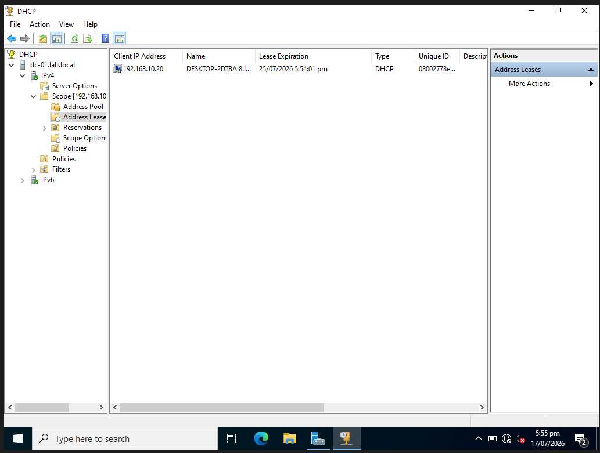
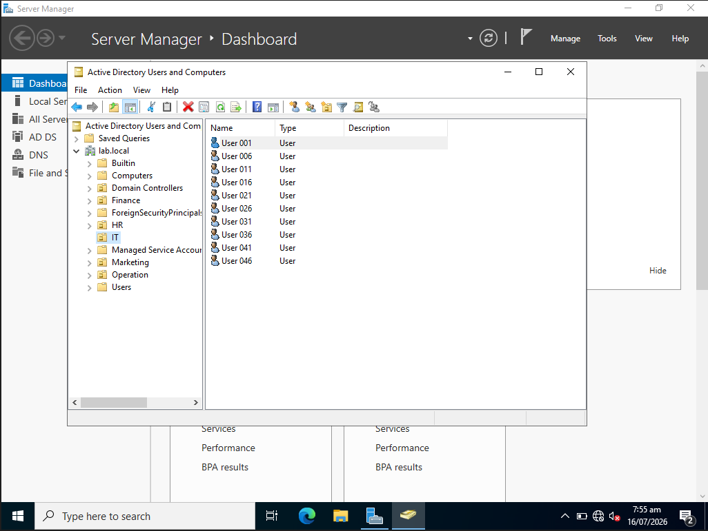
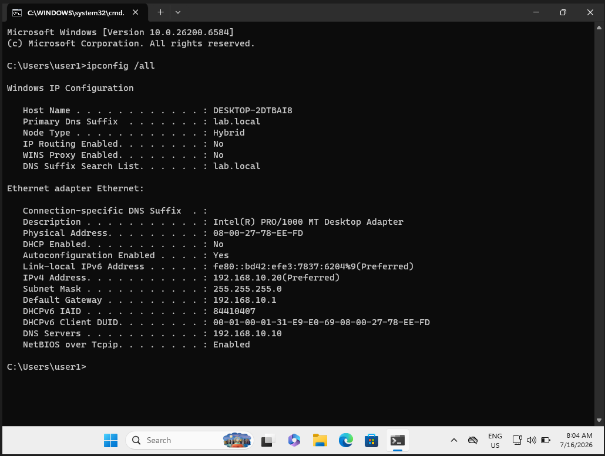
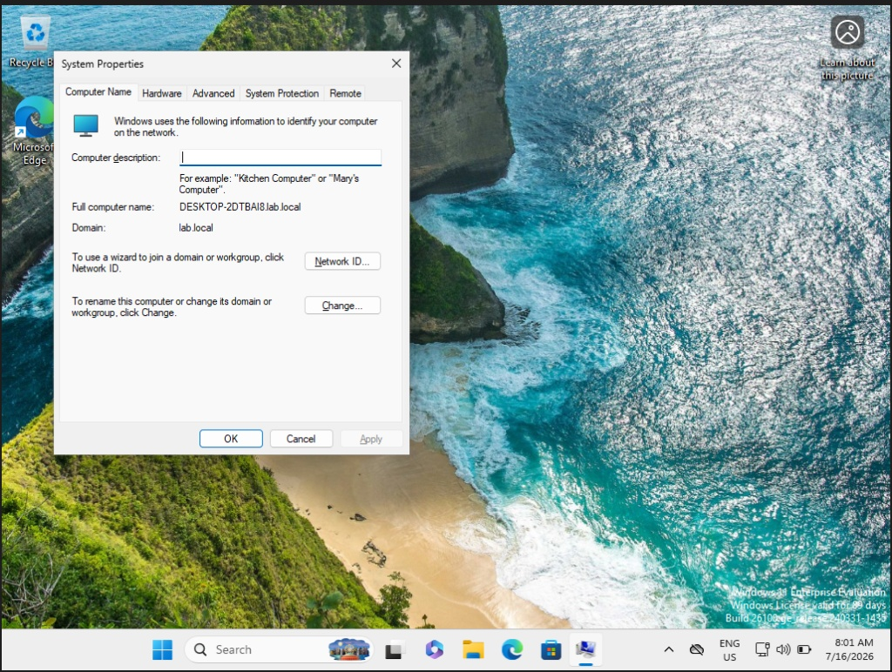
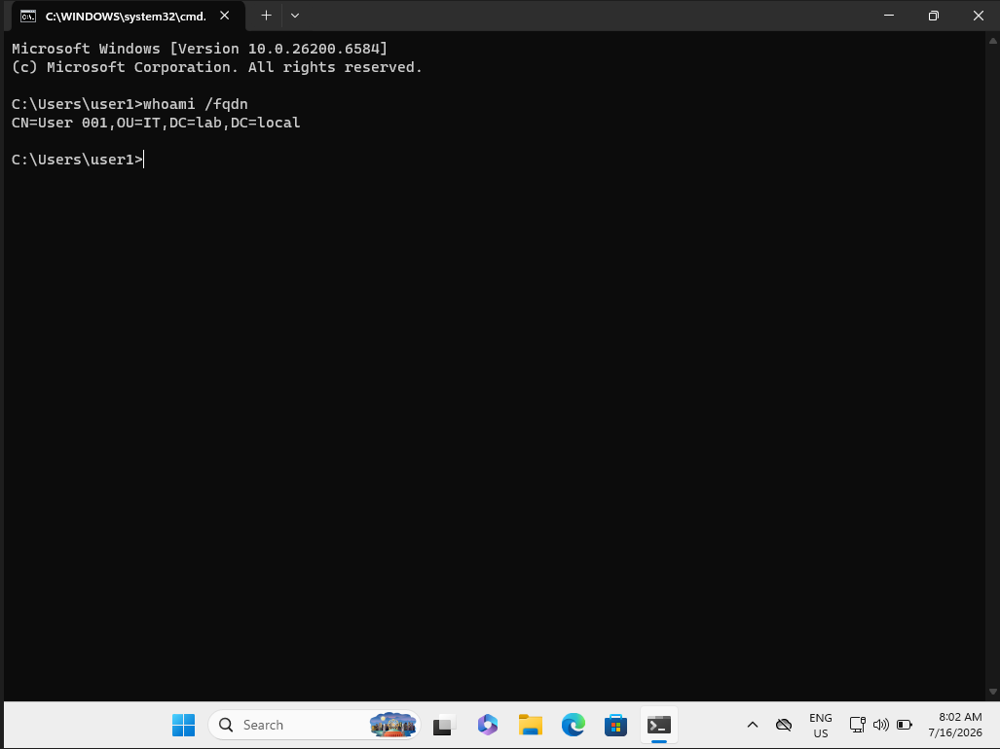
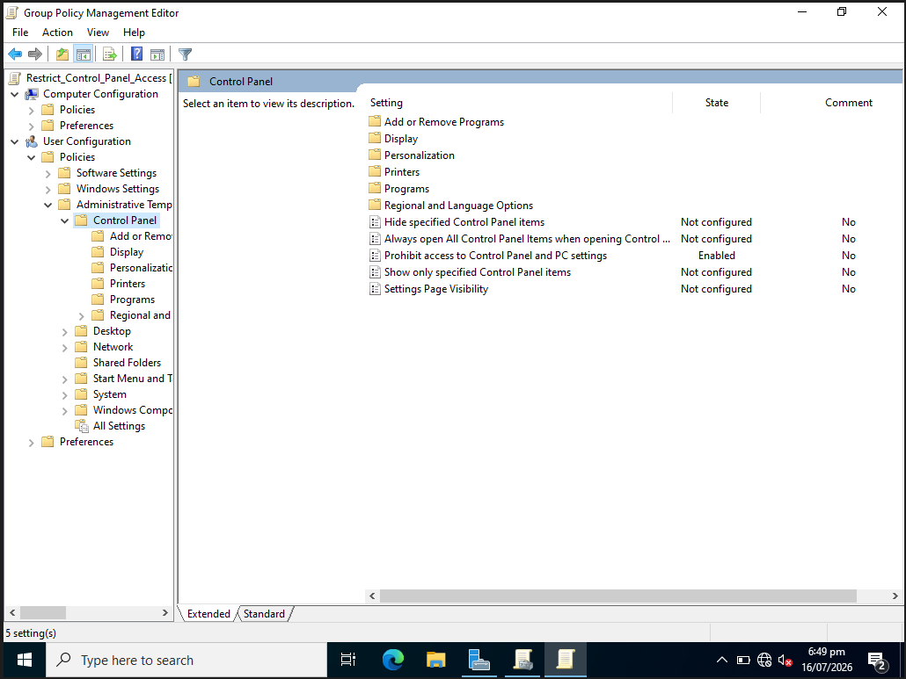
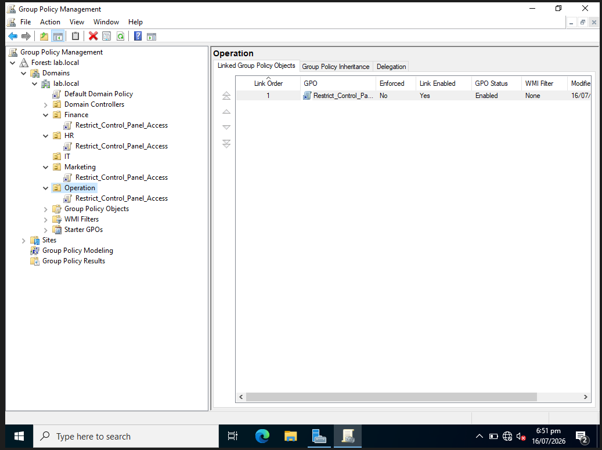
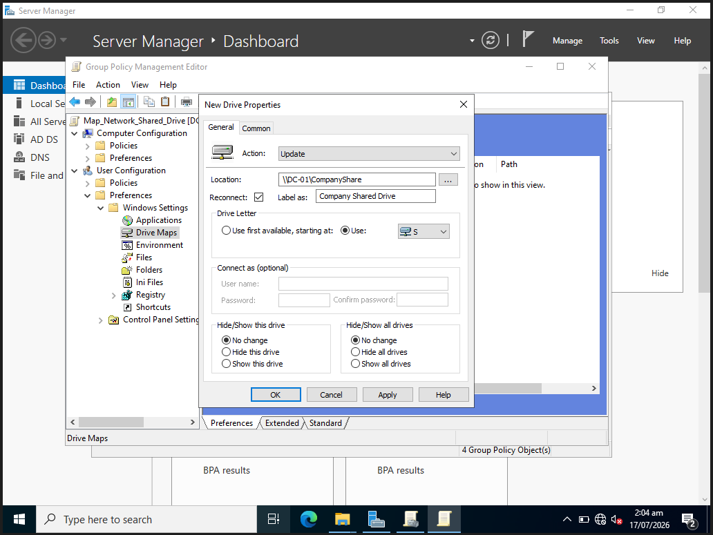
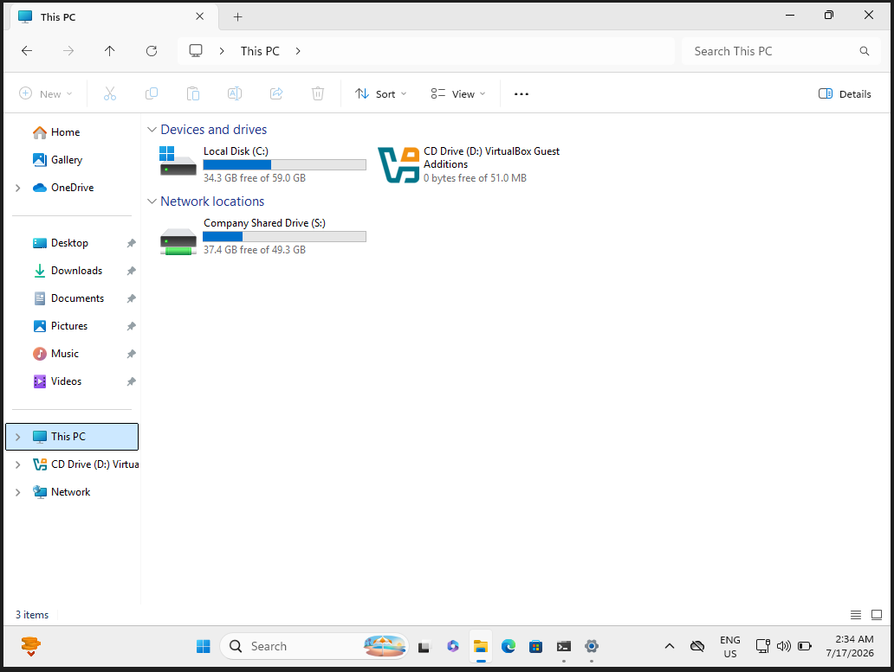

# Windows Server & Active Directory Sandbox Lab

## Project Overview
This project demonstrates the deployment and configuration of a virtualized enterprise network infrastructure. I designed and built an isolated lab environment featuring a Windows Server 2022 Domain Controller and a Windows 11 Enterprise client. The primary objective was to simulate a production corporate IT environment to gain hands-on experience with Active Directory Domain Services (AD DS), automated core directory management, network routing, and centralized security policy enforcement.

---

## Technical Stack & Competencies
* **Hypervisor:** Oracle VirtualBox
* **Directory Services:** Active Directory Domain Services (AD DS), Windows DNS Server, Windows DHCP Server
* **Operating Systems:** Windows Server 2022 Standard Evaluation, Windows 11 Enterprise
* **Automation:** Advanced PowerShell Scripting

---

## Topology & Network Architecture
The environment uses a dedicated, isolated virtual local area network (VLAN) topology with an external NAT gateway to facilitate controlled internet routing and DNS forwarding.

* **Subnet:** `192.168.10.0/24` (Configured via VirtualBox NAT Network)
* **Domain Controller (`DC-01.lab.local`):**
  * **Static IP Address:** `192.168.10.10`
  * **Default Gateway:** `192.168.10.1`
  * **Active Roles:** AD DS, DNS Server (with external forwarders pointed to `dns.google`), Authoritative DHCP Server
* **Workstation Client (`Win11-Client01`):**
  * **IP Address:** Dynamic IP lease (`192.168.10.20`) assigned dynamically via Enterprise DHCP
  * **Primary DNS Server:** `192.168.10.10` (Pointed to the Domain Controller for local record resolution)

---

## Key Implementation Milestones

### 1. Core Active Directory & DNS Infrastructure Deployment
* Initialized the physical hypervisor virtual routing switch to anchor the custom `192.168.10.0/24` network framework.
* Provisions static IPv4 assignments and loopback architectures on the base server operating system.
* Promoted the standalone server to an authoritative Domain Controller, bootstrapping the root forest domain `lab.local`.
* Established stable external internet connectivity across the isolated subnet by creating upstream DNS Forwarders to public DNS architectures.

### 2. Enterprise DHCP Server Implementation & Hypervisor Hardening
To simulate a real-world enterprise where clients automatically obtain IP leases, I transitioned the network from static configuration to central DHCP allocation.

* **Disabling Rogue DHCP Services:** Disabled VirtualBox’s built-in DHCP server engine on the `NatNetwork` interface. This prevented IP address allocation conflicts (e.g., getting a rogue interface lease) and ensured that the Windows Server Domain Controller was the sole authoritative DHCP lease-issuer on the subnet.
* **DHCP Server Role Installation:** Deployed and authorized the Microsoft DHCP Server role inside Active Directory on `DC-01`.
* **IP Scope Customization:** Programmed an active IPv4 scope designated as **"Lab Client IPs"** with a distribution pool of `192.168.10.20` to `192.168.10.254`, subnet mask `255.255.255.0`, and active scope options targeting our default gateway (`192.168.10.1`) and primary DNS configuration (`192.168.10.10`).

#### Active DHCP Server Management Console
The capture below validates the active state of the DHCP service scope on `DC-01`, displaying the active client network address lease handshake, target workstation hostname, and dynamic lease timeline:

### 3. Automation: Bulk Identity & Access Provisioning
To eliminate repetitive manual tasks, I developed and executed an optimized PowerShell pipeline script. The automation script programmatically generates specific corporate Organizational Units (OUs) and automatically provisions 50 unique test user accounts dynamically distributed across designated business departments with explicit security credentials.

> 🛠️ **View the Automation Script:** [PowerShell Provisioning Code File](./scripts/create-ad-users.ps1)

#### Directory Verification (ADUC)
The following capture validates the precise implementation of the target OUs and automated account instantiation:

### 4. Workstation Integration & Domain Join Validation
* Reconfigured the Windows 11 system adapter properties to register appropriately with the enterprise DNS hierarchy.
* Authenticated and joined the workstation machine cleanly to the `lab.local` active administrative root forest.

#### Core Network Configuration
Verification of the final workstation network interface layout and dynamic DHCP lease lookup using `ipconfig /all`:

#### Active Domain Integration Proof
System property verification confirming successful target domain join execution:

#### User Session & Credential Resolution Validation
Active terminal verification using the Full Distinguished Name lookup to prove a domain user account (`user1`) is fully authorized and logged in on the local machine:

### 5. Enterprise Security Baseline Enforcement (Group Policy)
To establish centralized administrative control and standard environment security, I engineered and deployed custom Group Policy Objects (GPOs) targeted at specific logical boundaries within the `lab.local` domain. 

---

#### Policy A: Restricting Control Panel & Settings Access
To prevent standard domain users from altering system configurations, modifying network adapters, or installing unauthorized software, I implemented a strict security baseline GPO to block local administrative tools.

* **Policy Name:** `Restrict_Control_Panel_Access`
* **Target Path:** `User Configuration \ Policies \ Administrative Templates \ Control Panel`
* **Enforced Setting:** Enabled **"Prohibit access to Control Panel and PC settings"**
* **Deployment & Scope:** Rather than enforcing this globally (which would lock out system administrators), the GPO was selectively linked directly to standard department Organizational Units (OUs)—specifically **Finance**, **HR**, **Marketing**, and **Operation**.

##### Group Policy Editor Configuration
The policy was structured to cleanly disable the Control Panel panel settings across user nodes:

##### Targeted OU Active Directory Linking
This console layout demonstrates the targeted GPO link deployment across our non-administrative departmental organizational units, isolating administrative accounts from the restriction:

---

#### Policy B: Persistent Network Drive Mapping (Group Policy Preferences)
To automate access to central storage, I configured a Group Policy Preference (GPP) mapping to mount a secure file share during user initialization.

* **Policy Name:** `Map_Network_Shared_Drive`
* **Target Path:** `User Configuration \ Preferences \ Windows Settings \ Drive Maps`
* **Configuration Settings:**
  * **Action:** `Update` (Ensures the drive is mapped, updated, and re-applied without forcing a complete recreation)
  * **Location:** `\\DC-01\CompanyShare`
  * **Reconnect:** Enabled (Ensures persistent mapping across user logon sessions)
  * **Label As:** `Company Shared Drive`
  * **Drive Letter:** Allocated statically to `S:`

##### Drive Map Preference Properties
This view confirms the exact configuration properties deployed to orchestrate the mapping execution:

##### Client-Side Mounting Verification
Upon running `gpupdate /force` from the client workstation terminal, the user security context refreshed, successfully resolving network pathways to mount the **Company Shared Drive (S:)** seamlessly under File Explorer:

